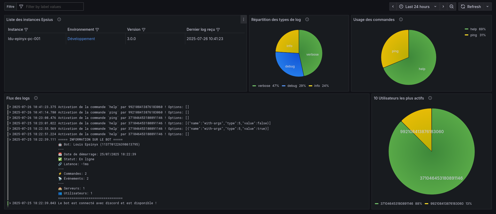

# Objectifs de la Version 3

Avant de foncer dans le développement de la version 3 du bot Epsius, il est crucial de définir clairement les objectifs à atteindre. Cette version vise à améliorer considérablement l'architecture et les fonctionnalités du bot pour offrir une expérience utilisateur optimale.

Vous trouverez ci-dessous la liste des objectifs par ordre de priorité :

{/* truncate */}

:::info
Ces objectifs sont en général un principe a appliquer a chaque étape et ne pourra être concidéré comme terminé que lorsque la version 3 sera mise en production.
:::

## Objectifs Principaux

- [ ] **Réimplémenter les commandes v1**: Implémenter l'ensemble des fonctionnalités contrairement à la version 2.
- [ ] **Amélioration de la gestion des erreurs**: Implémenter une gestion des erreurs robuste.
- [x] **Intégration de Winston**: Finaliser l'intégration de Winston pour la journalisation avancée avec l'intégration de metadonnées dans Loki.

## Objectifs secondaires (non obligatoires avant passage en production)

- [ ] **Documentation**: Mettre en place une documentation complète et à jour pour les développeurs et un changelog.
- [ ] **Implémenter les composants Discord v2**: Utiliser les nouveaux composants Discord v2 pour une meilleure interactivité et ne pas avoir de dette technique.
- [ ] **Passage en Multi-serveur**: Permettre au bot de fonctionner sur plusieurs serveurs Discord en parallèle.
- [ ] **Support de la Haute Disponibilité**: Mettre en place un système de haute disponibilité pour garantir la continuité du service.
